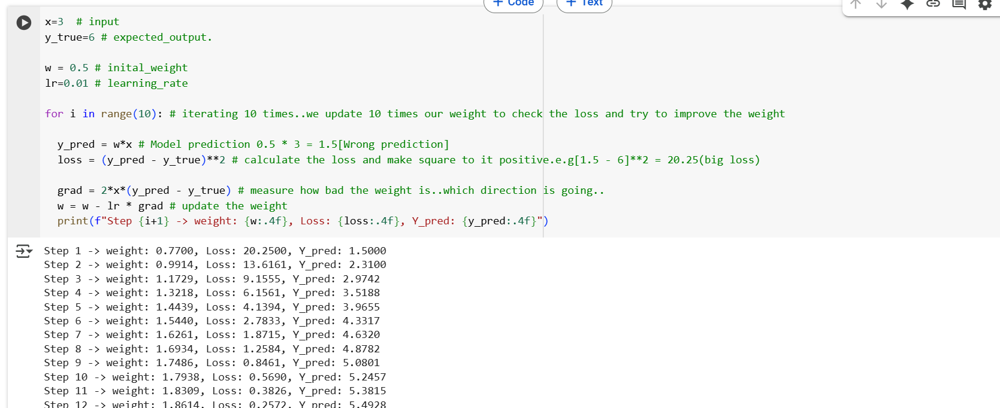
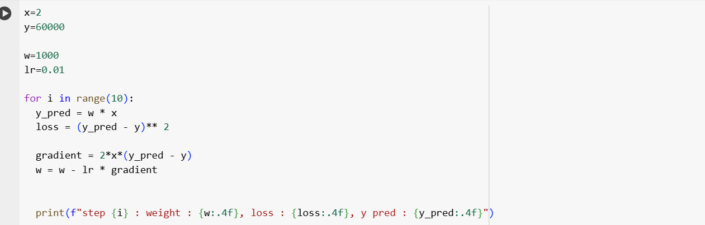

## 1. We want the model to learn the realtionship of y=2x.

- we need to give input the value and also give the expected output.
- Define the initial weight in w and learning rate with lr to calucate the steps.
- Iterate 10 times.
- first predicte the results(ypred = w * x)
- Calculate the loss from the predicted result to the actual value(ypred-y)**2, square root to get the positive 
- Calculate the gradient(In which direction the loss is how much loss), 2 * (ypred - y)*x.
- update the weight, we move in the opposite direction from the grident to reduce the loss, w - lr * gradient.

## 2. Based on the experience predict the salary.

- Take a random weight check the loss, you can choose between 0 to 1000.
- And also lr make sure start with something like 0.1 or 0.01. try few values and see how it goes.
- if it is not learning or learning too slow increase the lr like from 0.1 to 1.
- If loss jumps around or get worse - decrease lr.

