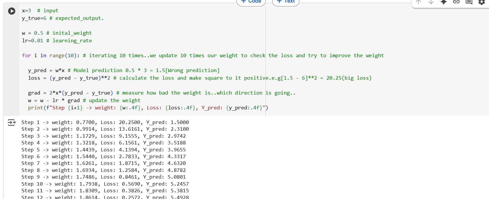

## Calculas in AI

- start with random weight(if the weight is low, we don't have confidence in this model,if it is high we can have)
- Model gets the input
- Makes a prediction
- And also calculate the loss(Loss tell how wrong the model is based on the weight).
- Sympy(Symbolic Math) library.

## 1. Derivatives

- Using Derivatives we can changes the weight to reduce the loss or reduce the error.

## 2. Gradients

- Gradients will tell which direction you need to go to reduce the loss quickly(faster).

## 3. Gradients Descent

- It is a optimization algorith
- Using gradients deccent, we can keep on changing the weights in the opposite direction of the gradient until the loss is small.

## 4. Chain Rule

- chain rule will help us to calculate how a small change in one input  affects the final output,
- one function depends on others..chaining multiple layers.

## 5. Parital Derivatives

- If we have multiple inputs e.g like x,y, we can one variable and we can measures how change in one variables and affect the result.

## 6. Backpropagation

- First it makes prediction.
- Then it see how wrong the model was(error/loss).what is the loss
- Then it goes backward wiith the help of chain rule and calculate how each layer contributed to the error.
-  update the weight and repeat
- Learn from the mistakes.

## 7. Activation

- using relu, we can check for the positive value.If it is there it will return orelse if it is negative we return 0

## 8. Hidden Layer

- Input Layer > Hidden Layer > Output.(Data goes from input through hidden layer to the output)
