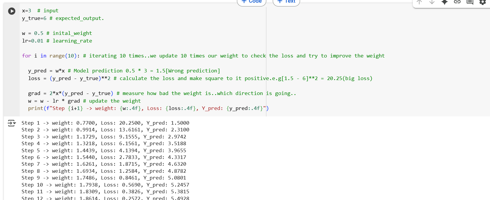

## 1. we want the model to learn the realtionship:

```
        y = 2x

    if x=3, which means y=6.

```

- we need to input the value and also give the expected output.
- Define the initial weight in w and learning rate with l to calucate the steps.
- Iterate 10 times.
- first predicte the results.
- Calculate the loss.
- Calculate the gradient(which means how much loss and the direction)
- update the weight.

