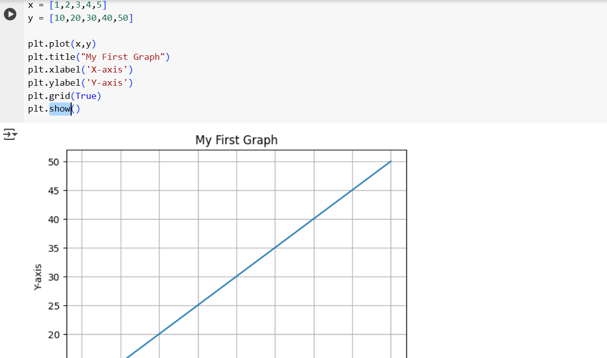

## 1. Matplotlib.

- using matplotlib, we can have visulatization of the data
- matplotlib supports line chart, bar chart, graph chart
- pyplot as a main module for plotting..
- import matplotlib.pyplot as plt

    