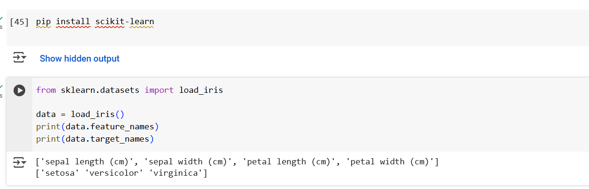
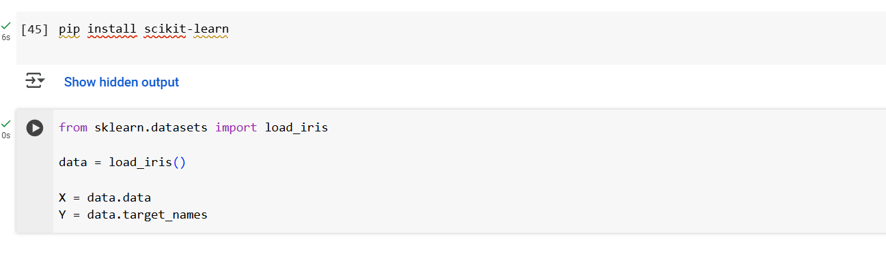
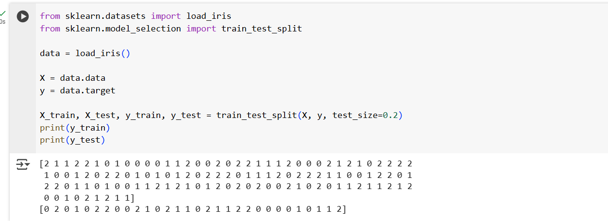
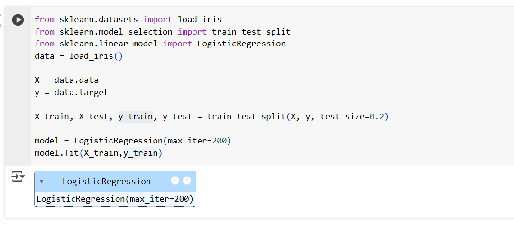
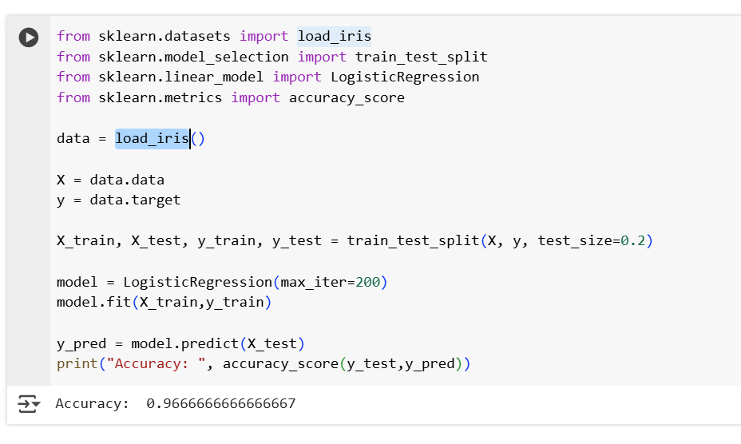

## Scikit

- Loading the sample data
- Splitting the data for training/testing
- Building models like regression/classification
- Evaluating model accuracy

## 1. Load the sample data

- Iris dataset loads flower withe the features and targets.
        
    

## 2. Splitting the Features(X) and Labels(Y)

- Split the data into X and Y. X stores input features(petals/sepal length and widht) and Y holds output/Target.

    

## 3. Train-Test Split

- Used to split the data into training and testing.
- 80% of the data is used for training and 20% is used for testing.
    
    

## 4. Build Model 

- This is our machine learning model for classification.
- create a Logistic regression model
- .fit() makes the model learn from the training data

## 5. Evaluating the Model

- The model predicates the flower type for the test set.
- compares actual answer(y_test) with predicted ones(y_pred)
- return numbers like 0.96 which is 96% accurate.
- Classification reports provides  precision, recall and f1-score.

