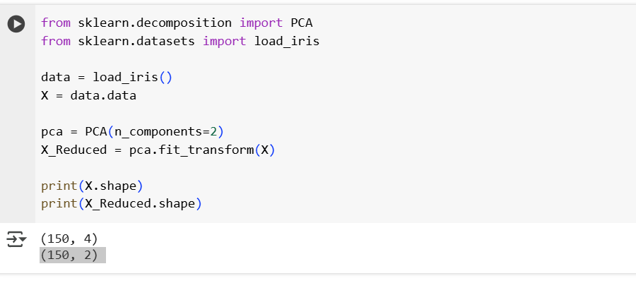

## PCA with Eigenvalues (Dimensionality Reduction)

- We will reduce the data from 4 dimensions to 2 dimensions using PCA.
- Instead of writing complicated algorithms from the scratch, use sklearn.
- Using Sklearn we can import a model, train it, predict with it, evaluate it, preprocess and visulize the data.
- sklearn.decomposition is a ready made tool that standardizes the data, computes the covariance matrix, find eigen values and eigen vectors and projects the data into lower dimensions.
- load_iris brings the datasets.
- we are telling PCA to reduce the data from 4D -> 2D.
- fit() calculates the eigen vectors and eigenvalues.
- transform() project the data into 2 pca.

