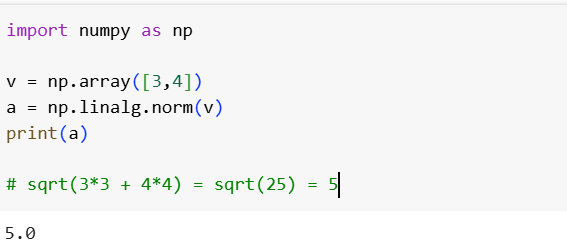
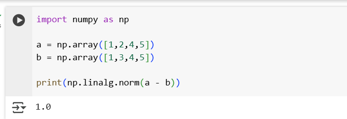
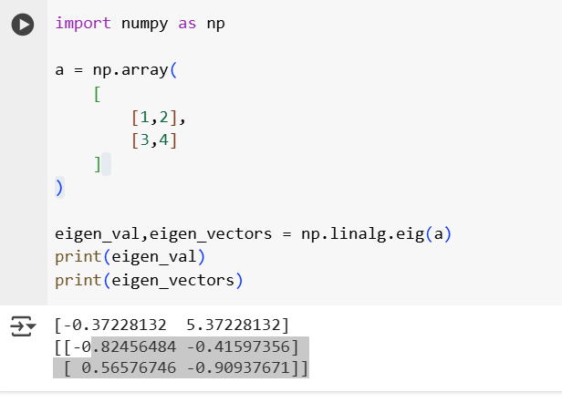
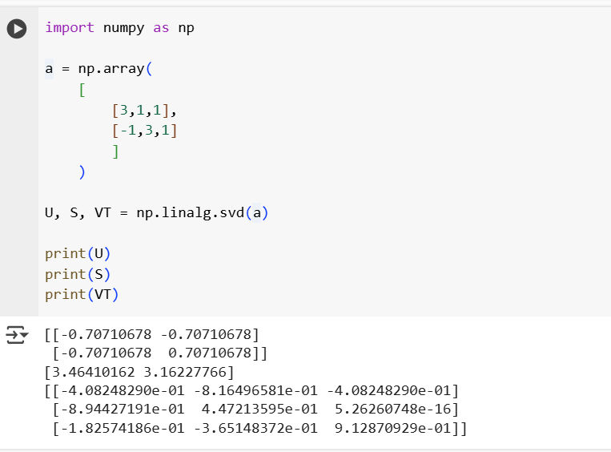

## 2. Linear Alebra

- **L2 Norm(Eucliden Norm)**

    

- **L1 Norm(Manhattan Norm)**

    

- **Distance Matrices** : Euclidean distance.

    

- **EigenValues & EigenVectors** :
- Eigen vector like a direcion..that doesn't change.
- Eigen values are like how much it is strches or shrik.

    

- **Singular Value Decomposition** : Using SVD we can break the matrix into 3 pieces and we can reconstruct.

    

- **Loss function**: Loss function is used to check how wrong our model is.Types of Loss functions.

- Mean Squared Error: common for predicting numbers.
- Mean Absolute Error: treat everything equally
- Binaray cross entropy: Yes/No and spam/Not spam
- categorical cross entropy: predict more than 2 classes. predict if a photo is a dog, cat or rabbit.