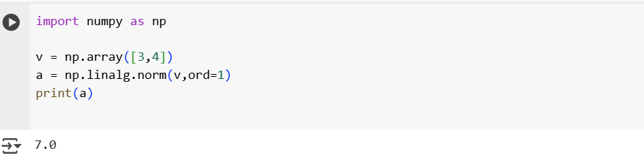

## Linear Algebra

- import numpy as np is the package we need to use.
- np.linalg, Linear Algera is module available in np package.
- norm is distance between the vectors.

## 1. L2 Norm(Eucliden Norm)

- L2 Norm is the shortest distance from A to B.
- you can cut diagonally[Shortest distance].
- sqr(3)+sqr(4) = sqr(9+16) = 5.

    

## 2. L1 Norm(Manhattan Norm)

- L1 is the you need to walk along the street to reach from A to B[horizontal + vertical].
- You cannot cut diagonally.
- sum of the absolute values.

    

## 3. Distance Matrices(Euclidean distance)

- It calculates the distance betweeen two vectors.

    

## 4. EigenValues & EigenVectors

- If you apply transformation to a shape, most directions change.But some directions won't change..these special directions only get stretched or shrinked.
- These special directions are called eigen vectors.
- How much it get stretched or shrinked is called eigen values.
- Why AI needs eigne values and eigen vectors, because AI will deal with lots of data - It needs to find the pattern, reduce noise or make some decision.But data is larger and messy.
- Using Eigen values and Eigen vectors we can keep the directions which is having big eigen values and we can remove the unwanted data.

    

## 5. Singular Value Decomposition

- Using SVD we can break the matrix into 3 parts which is U(mxm), sigma(mxn), V(nxn).
- Why do need to break it, we can reduce the noise reduction(keep only meaningfull data), reducing compression(data compression)
- For re-constructing convert the sigma into diagnoal matric can re-construct it again.

    

## 6. Loss function

- Loss function is used to check how wrong our model is.Types of Loss functions.
- **Mean Squared Error:** common for predicting numbers.
- **Mean Absolute Error:** treat everything equally
- **Binaray cross entropy:** Yes/No and spam/Not spam
- **Categorical cross entropy:** predict more than 2 classes. predict if a photo is a dog, cat or rabbit.