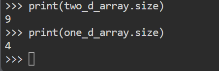
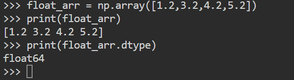
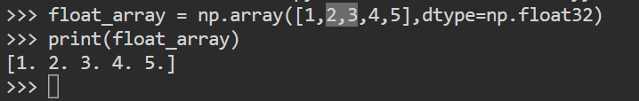
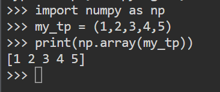
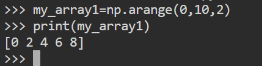
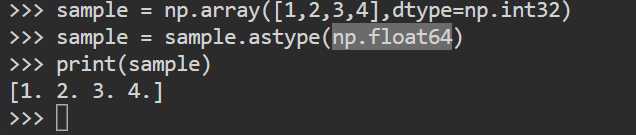

## Numpy

- It is library.It is used for array and matrix

```
    import numpy as np
    one_d_arr = np.array([1,2,3,4])
    two_d_arr = np.array([[1,2,3],[4,5,6],[7,8,9]])
    print(one_d_arr)
    print(two_d_arr)

```

## 1. Numpy Attribute.

- **Shape:** it returns the dimensions. 

    

- **Size:** it returns the size of the array

    

- **Ndim :** it returns the array dimensions whether it is one or two dimensions.

- **Dtype:** it returns the datatype of the array.It supports various data types like Integer,float, complex.while creating we can specify.

    
    

- **Tuple to array:** conversion of tuple to array.

    

- **Zeros and Ones :** print the zeros and ones based on the input.

- **Arange :** it arranges the number based on the range.

    

- **Modify the array:** modify the array using arr[3] = 5,arr[1:3] = [1,2,3]

- **Convert an array:** we can convert the array to another data type using astype function.

    