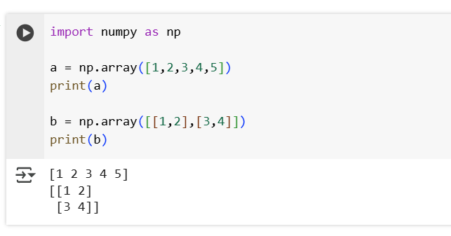
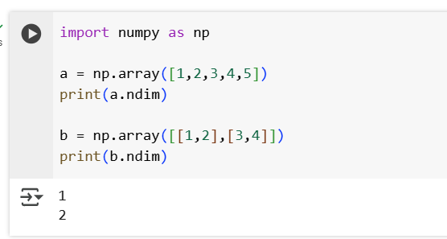
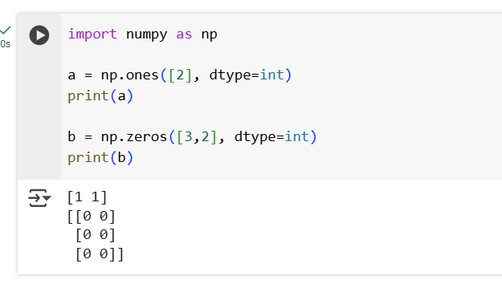
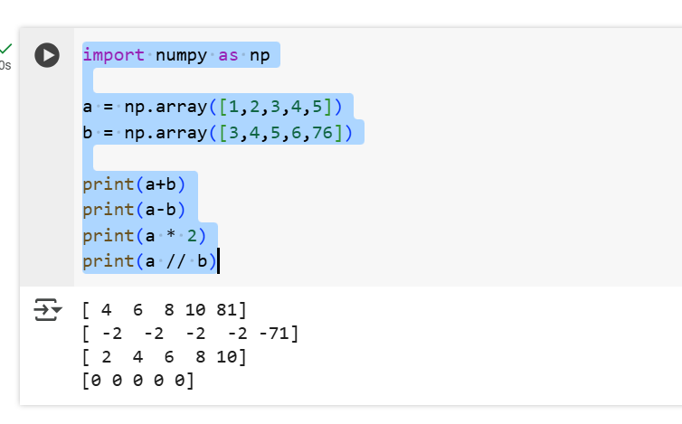
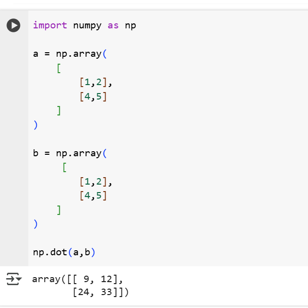
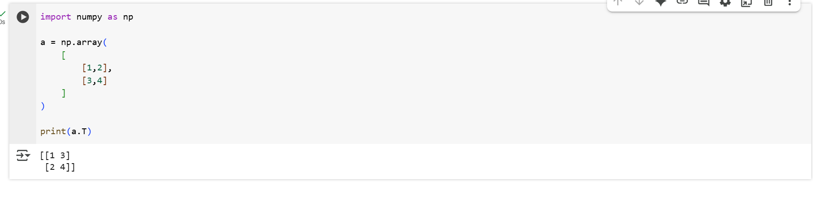
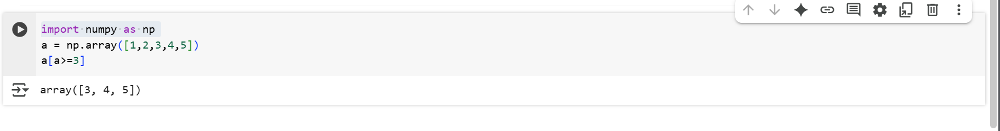
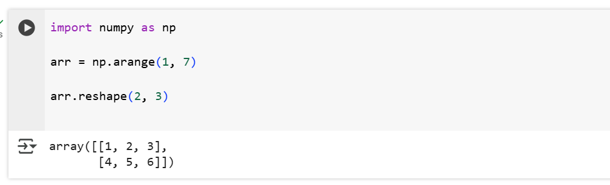
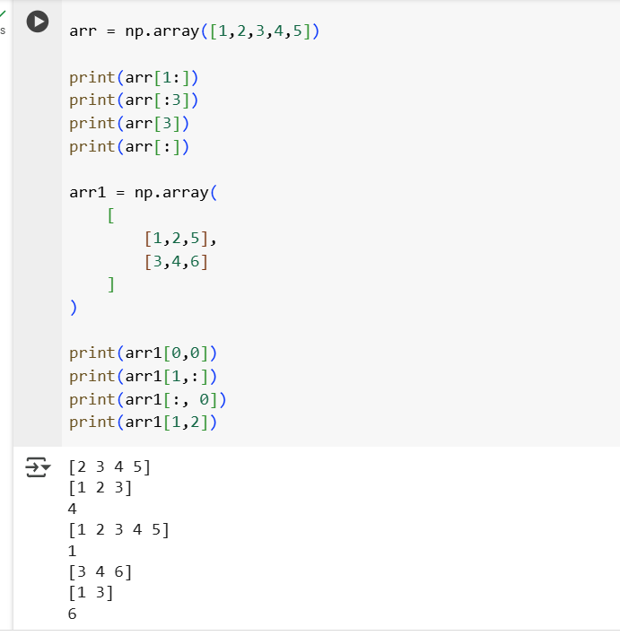

## Numpy

- It is library.It is used for array and matrix
    
    

## 1. Shape
- It returns the dimensions whether it is (5,) or (2,3).

    

## 2. Size
- It returns the size of the array like how many values inside an array or matrix.

    

## 3. Ndim
- It returns the array dimensions whether it is one or two dimensions.

    

## 4. Dtype
- It returns the datatype of the array.It supports various data types like Integer,float, complex.while creating we can specify.
- While we creating we can convert float array to int array using dtype.

    
    

## 5. Tuple to array
- Conversion of tuple to array.

    

## 6. Zeros and Ones
- Print the zeros and ones based on the input.

    

## 7. Arange
- It arranges the number based on the range.

    

## 8. Modify the array
- Modify the array using arr[3] = 5,arr[1:3] = [1,2,3]

## 9. Convert an array 
- We can convert the array to another data type using astype function.

    

## 10. Math Operation
- We can perform math operation like add,sub,multiply and divide.

    

## 11. Matrix Multiplication
- Multiplying two vectors.

    

## 12. Transpose
- Transpose an vector.

    

## 13. Filtering
- Filtering the array.

    

## 14. Reshaping array
- Reshaping the array.

    

## 15. Indexing and Slicing
- Indexing and slicing the array.

    

