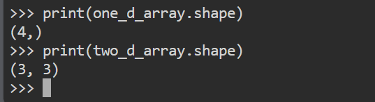
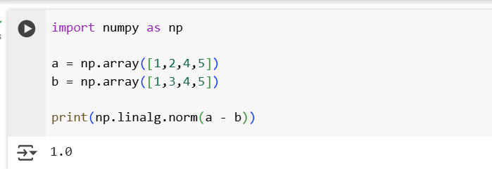

## Numpy

- It is library.It is used for array and matrix

```
    import numpy as np
    one_d_arr = np.array([1,2,3,4])
    two_d_arr = np.array([[1,2,3],[4,5,6],[7,8,9]])
    print(one_d_arr)
    print(two_d_arr)

```

## 1. Numpy Attribute.

- **Shape :** it returns the dimensions. 

    

- **Size :** it returns the size of the array

    

- **Ndim :** it returns the array dimensions whether it is one or two dimensions.

- **Dtype :** it returns the datatype of the array.It supports various data types like Integer,float, complex.while creating we can specify.

    
    

- **Tuple to array :** conversion of tuple to array.

    

- **Zeros and Ones :** print the zeros and ones based on the input.

- **Arange :** it arranges the number based on the range.

    

- **Modify the array :** modify the array using arr[3] = 5,arr[1:3] = [1,2,3]

- **Convert an array :** we can convert the array to another data type using astype function.

    

- **Math Operation :** we can perform math operation like add,sub,multiply and divide.

    

- **Matrix Multiplication :** Multiplying two vectors.

    

- **Transpose :**

    

- **Filtering :**

    

- **reshaping array :**

    

- **Indexing and Slicing:**

    

## 2. Linear Alebra

- **L2 Norm(Eucliden Norm)**

    

- **L1 Norm(Manhattan Norm)**

    

- **Distance Matrices** : Euclidean distance.

    

- **EigenValues & EigenVectors** :
- Eigen vector like a direcion..that doesn't change.
- Eigen values are like how much it is strches or shrik.

    

- **Singular Value Decomposition** : Using SVD we can break the matrix into 3 pieces and we can reconstruct.

    

- **Loss function**: Loss function is used to check how wrong our model is.Types of Loss functions.

- Mean Squared Error: common for predicting numbers.
- Mean Absolute Error: treat everything equally
- Binaray cross entropy: Yes/No and spam/Not spam
- categorical cross entropy: predict more than 2 classes. predict if a photo is a dog, cat or rabbit.