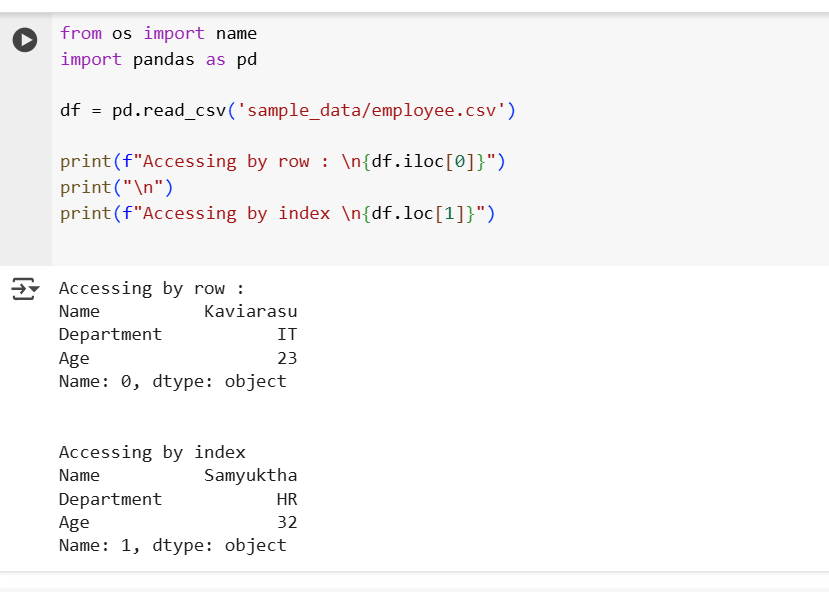

## 1. Pandas

- worrks with tabular data
- Handles CSV, Excel, JSON.
- Allows Filtering, cleaning and transforming..
- import pandas as pd

## 2. Commands

- **Reading CSV** : read a csv using read_csv function in pandas.

    

- **Viewing the data** : viewing the data using multiple commands

    

- **Accessing the data** : accessing the data

    

    

- **Basic Operation** : Basic Operations like modifying data and adding a new column.
    
    

- **Filters** :

    

- **Updating and modifying** :

    

- **Grouping and Sorting** : 

    

- **Handling Missing Values** : 

    