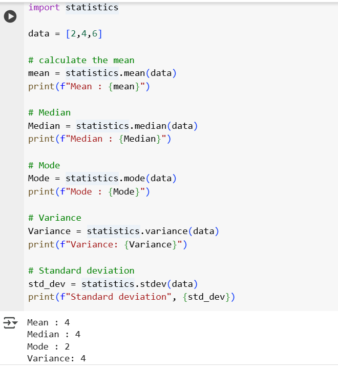
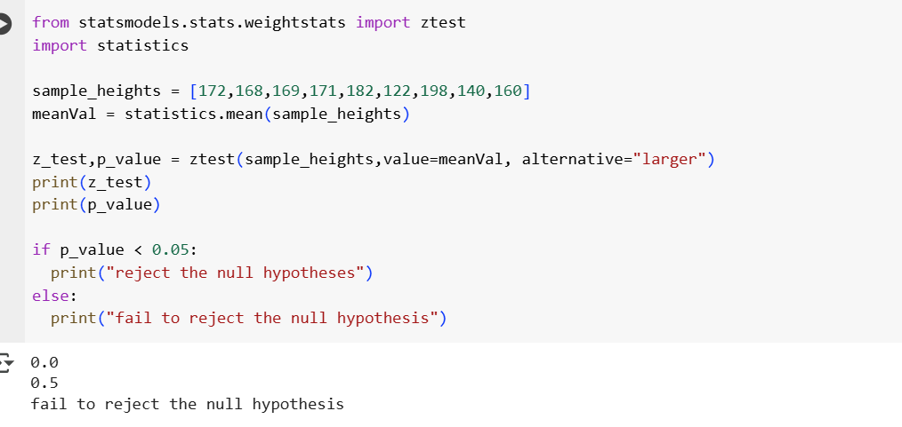
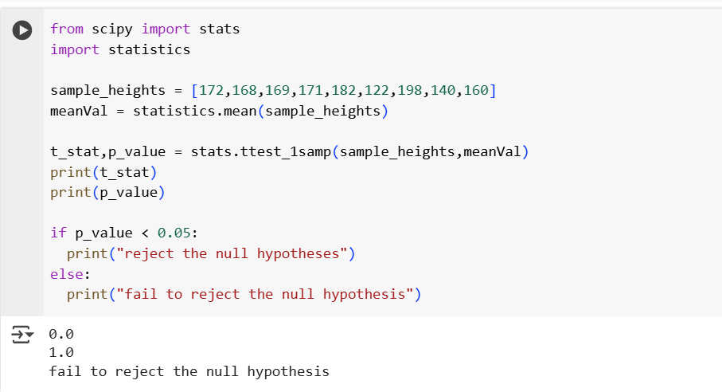

## 1. Descriptive Statistics

List = [3,7,7,2,9]

- Mean is a average value which sum/count: 28/5 = 5.6
- Median: Middle Number = 7.
- Mode: Most frequent value = 7.
- Range: Max=9, Min =2., Max - Min = 9-2 = 7.
- Variance: subtract the mean from each number, then square the result.
- Standard deviation: square root of variance.

    

## 2. Probability Theory

- Let say if a coin is tossed. what is the probabilty it lands on head.(50-50)
- **Independent Events :** Two events are independent if the outcome doesn't affet the outcome of others.
- **Dependent Events :** Two events are dependent if the outcome  affet the outcome of others.

## 3. Random Variables

- It helps with different outcome.
- **Discrete Distributions** : countable outcomes.
- **Continuous Distributions** : inifinte outcomes.

## 4. Expectations, Variance, SD.

- Expectations
- Variance
- Standard deviation

## 5. Probabilty Distribution

- Binomial, Poission
- Uniform, Normal, Exponentail.

## 6. Central Limit Theorem

- Sample means of any population will tend toward a normal distribution as a sample size increase.

## 7. Bayes Theorem

- It help us to reverse the possibilites after seeing the evidence..

## 8. Hypothesis Testing.

- **Null Hypothesis :** Null Hypothesis is like there is no change or difference.E.g Math App does not improve the student test scores.
- **Alternative Hypothesis :** Alternative Hypothesis is like there is change and difference.E.g Math does improve the student test scores.
- **p-value :** If the p-value lesser than 0.05 we reject the null hypothesis(H0) and the app has some effect. if the p value is greater than 0.05 fail to reject H0.E.g H0 app has no effect and app has some effect
- **Z-Test :** When the standard deviation is known, sample size is greater than 30.

    

- **T-Test :** when the standard deviation is not known, sample size is lesser than 30.

    
    
- **Confidence Interval :** Confidence Interval is like it gives the percentage. for eg: suppose the average height of 100 men is 170 cm. A 95% Confidence interval says.

## 9. Coorelation and Covariance

- These helps us to understand the realtionship between variables.
- **Covariance** : Covariance tells us how two variables vary together.
- **Correlation** : Correlation standardizes covariance to a range of [-1,1]